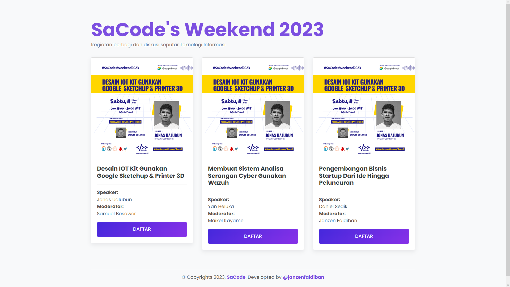

# JSON to HTML

Contoh penerapan data JSON yang ditampilkan dalam dokumen HTML.

## Detail JavaScript Codes

```
var sacodesWeekend = [
    {
        'no':'01', 
        'topic':'Desain IOT Kit Gunakan Google Sketchup & Printer 3D', 
        'poster_url':'https://sacode.web.id/posters/weekend/poster-01.png', 
        'speaker':'Jonas Ualubun',
        'moderator':'Samuel Bosawer',
        'status':'publish',
    },
    {
        'no':'02', 
        'topic':'Membuat Sistem Analisa Serangan Cyber Gunakan Wazuh', 
        'poster_url':'https://sacode.web.id/posters/weekend/poster-01.png', 
        'speaker':'Yan Heluka',
        'moderator':'Maikel Kayame',
        'status':'publish',
    },
    {
        'no':'03', 
        'topic':'Pengembangan Bisnis Startup Dari Ide Hingga Peluncuran', 
        'poster_url':'https://sacode.web.id/posters/weekend/poster-01.png', 
        'speaker':'Daniel Sedik',
        'moderator':'Janzen Faidiban',
        'status':'publish',
    },
]

buildTable(sacodesWeekend)

function buildTable(data){

    var table = document.getElementById('theData')

    for (var i = 0; i < data.length; i++){
        
        var row = `
        <div class="col-lg-4 col-md-6 mb-3">
            <div class="card single-review ">
                
                <div class="card-body">
                    <h4 class="text-dark font-weight-bold h5">${data[i].topic}</h4>
                    <hr>
                    <p><b class="d-block">Speaker:</b> ${data[i].speaker}</p>
                    <p><b class="d-block">Moderator:</b> ${data[i].moderator}</p>

                    <a href="https://instagram.com/sacode.official" target="_blank" class="btn btn-warning btn-lg w-100 text-uppercase fw-bold rounded-top-0 mt-3">Daftar</a>
                    
                </div>
            </div>
        </div>`

        table.innerHTML += row

    }
}
```

## Screenshot hasil desain



## Demo di GitHub Pages

Lihat demo di sini : https://janzenfaidiban.github.io/json-to-html/

